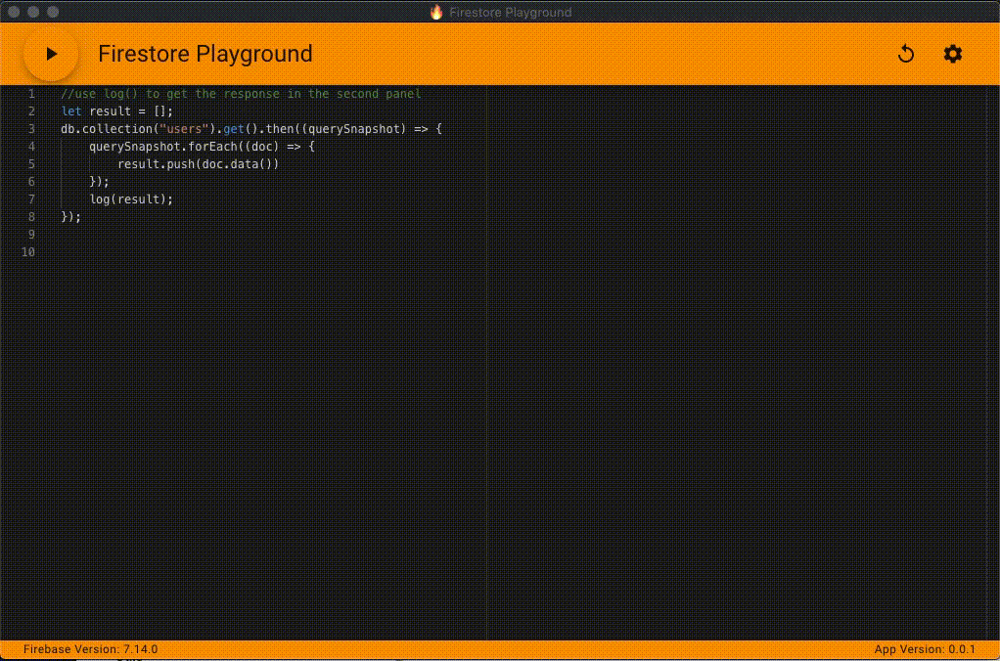
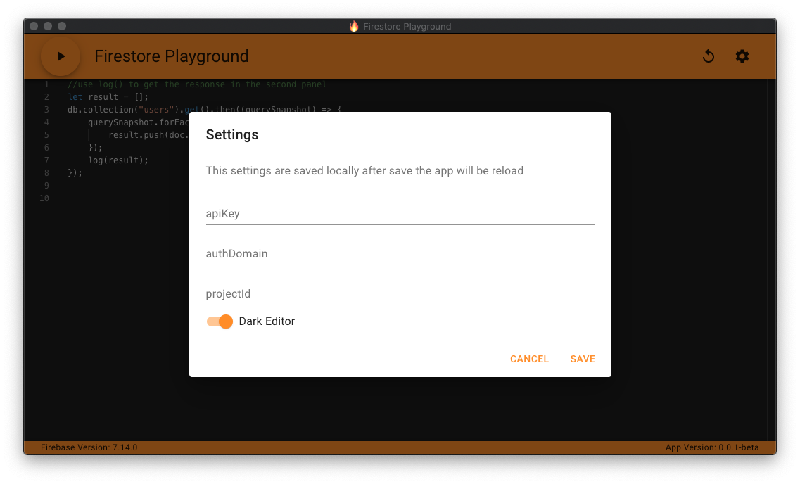

# Firestore Playground


### A Desktop app to create firestore querys




## Install

Download the release from the releases tab (currently only mac build)

## Build
Clone the repository

install the dependencies:

```bash
npm install
```

## Usage

```bash
npm run dev
```

## Packaging
We use [Electron builder](https://www.electron.build/) to build and package the application. By default you can run the following to package for your current platform:

```bash
npm run dist
```

This will create a installer for your platform in the `releases` folder.

You can make builds for specific platforms (or multiple platforms) by using the options found [here](https://www.electron.build/cli). E.g. building for all platforms (Windows, Mac, Linux):

```bash
npm run dist -- -mwl
```

